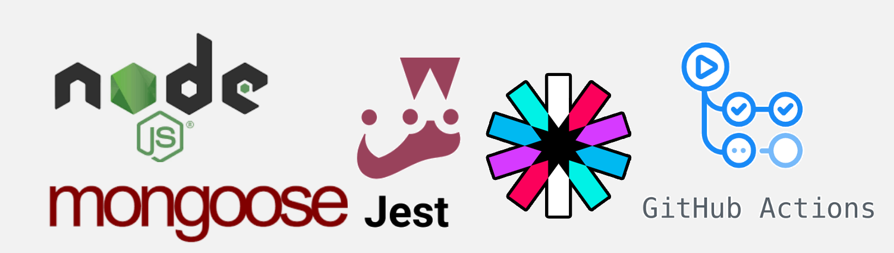

[](https://github.com/ialbas/test-node-backend/actions/workflows/node.js.yml)
[](https://standardjs.com/)
[](https://standardjs.com/)
[](https://opensource.org/licenses/MIT)

## Backend API Rest NodeJs with TDD and Clean Code



## A simple project example with Node, Jest, JWT, Mongoose and outher resources.

## Sumary

- [Sumary](#sumary)
- [Getting Started](#getting-started)
- [Features](#features)
- [Documentation](#documentation)
- [Libraries and Packages](#libraries-and-packages)
- [Licence](#license)

## Getting Started

Requeriments and Instructions

1. Install packages with `npm install`
2. To see Tests and Coverage `npm run test`
3. Initialize this server `npm run start`
4. For data persistence set your string connection in file `.env` do like the example in file `.env-local`
5. Initialize docker-compose: `docker-compose up -d ` for container Docker MongoDB
6. For `Postman` there are `collections` with all routes and `envioriments` to apply in your postman console. See more in folder ./postman

## Features

This API allows running basic CRUD with `mongodb` and authenticating routes with JWT and also has some other features listed below:

- Using some [Best Practices](https://stackoverflow.blog/2020/03/02/best-practices-for-rest-api-design/) for good Rest API design.
- Using [pagination](https://www.npmjs.com/package/mongoose-paginate) on the API for the listing of the posts
- Using Unit testing for all Routes and Helpers using `Jest`.
- Using Integration testing for all Routes and Helpers using `Postman`.
- Using [Semantic Versioning 2.0.0](https://semver.org/spec/v2.0.0.html) for controll verersion in [Git Tag](https://git-scm.com/book/en/v2/Git-Basics-Tagging), has the ability to tag specific points in a repository’s history.
- Full documentation for all routes, with [Postman Documentation](https://documenter.getpostman.com/view/11001155/UVsPN4e4) to public documentation and Integration Tests.
- Using `Lint Staged`
- Using `Husky` hooks to pre-commits and push to repository
- Using JWT for Routes Authentication
- Using `Mongose Validation` for Process and validate of body
- Implementing some principes `SOLID`
- Using [GitHub Actions](https://github.com/ialbas/test-node-backend/actions) to CI deployment
- Great tests coverage about 90%
- Using `MongoDB` for local storage data in container `Docker` and `Docker-Compose` to manage containers

## Documentation

- Login Route Example

```bash
Request:

POST /api/auth/login HTTP/1.1
Host: localhost:3000
Uri: localhost:3000/api/auth/login
Content-Type: application/json

Body:

{
	"email":"any_email@mail.com",
	"password": "any_password"
}
```

Response Header:

```bash

access-control-allow-origin: *
connection: keep-alive
content-length: 251
content-type: application/json; charset=utf-8
date: Thu, 17 Mar 2022 00:00:00 GMT
etag: W/"fb-ZZqLmFuja50yJ+k8HEGYw5mJ+x8"
keep-alive: timeout=5
x-powered-by: Express
```

Response Body has correcly credentials

```bash
{
  "statusCode": 200,
  "description": "ok",
  "data": {
    "accessToken": "any_jwt_token"
  }
}
```

Response Body: incorrecly credentials

```bash
{
    "statusCode": 401,
    "description": "unauthorized",
    "error": {
        "name": "user unauthorized."
    }
}
```

- For all routes (getById, getAll, create, update and remove) it is necessary to send Bearer JWT, otherwise it will return `unauthorized`:
  ⚠️Caution: for this example, we should send the word `Bearer` before JWT access token

```bash
{
    "statusCode": 401,
    "description": "unauthorized",
    "error": {
        "name": "Failed to authenticate token."
    }
}
```

- Get By ID Route Example

  ⚠️Caution: for this example, for ID, we used UUID in version 4

```bash
Request:

GET /api/post/:id HTTP/1.1
Host: localhost:3000
Uri: localhost:3000/api/post/7ad8b353-98fb-41fb-85c7-dd83f26218f5
Content-Type: application/json
Authorization: "Bearer any_jwt_token"

Body: {}
```

Response Header:

```bash

access-control-allow-origin: *
connection: keep-alive
content-length: 244
content-type: application/json; charset=utf-8
date: Thu, 17 Mar 2022 00:00:00 GMT
etag: W/"fb-ZZqLmFuja50yJ+k8HEGYw5mJ+x8"
keep-alive: timeout=5
x-powered-by: Express
```

Response Body has token credentials and UUID

```bash
{
    "statusCode": 200,
    "description": "ok",
    "data": {
        "_id": "7ad8b353-98fb-41fb-85c7-dd83f26218f5",
        "title": "get a text",
        "body": "get a body",
        "tags": [
            "valid_tag_one",
            "valid_tag_two",
            "valid_tag_three"
        ]
    }
}
```

Response Body if ID it's `NULL UUID`

```bash
{
    "statusCode": 400,
    "description": "bad request",
    "error": {
        "name": "Missing param: id"
    }
}
```

Response Body if ID it's `NOT FOUND UUID`

```bash
{
    "statusCode": 404,
    "description": "not found",
    "error": "id"
}
```

- Get By All Route Example

```bash
Request:

GET /api/post/:id HTTP/1.1
Host: localhost:3000
Uri: localhost:3000/api/post/page=1&size=2
Content-Type: application/json
Authorization: "Bearer any_jwt_token"

Body: {}
```

Response Header:

```bash

access-control-allow-origin: *
connection: keep-alive
content-length: 244
content-type: application/json; charset=utf-8
date: Thu, 17 Mar 2022 00:00:00 GMT
etag: W/"fb-ZZqLmFuja50yJ+k8HEGYw5mJ+x8"
keep-alive: timeout=5
x-powered-by: Express
```

Response Body has correcly token and parameters (page and size)

```bash
{
    "statusCode": 200,
    "description": "ok",
    "data": {
        "docs": [
            {
                "_id": "7f837785-7ac6-4d17-9bbc-dbcea5d6c8aa",
                "title": "any_title_name_modify",
                "body": "any_body, some_body",
                "tags": [
                    "valid_tag_one",
                    "valid_tag_two",
                    "valid_tag_three"
                ]
            },
            {
                "_id": "78bddc02-94ce-4911-9aa5-d1903ef2a2b4",
                "title": "any_title",
                "body": "any_body, some_body",
                "tags": [
                    "valid_tag_one",
                    "valid_tag_two",
                    "valid_tag_three"
                ]
            }
        ],
        "total": 100,
        "limit": 2,
        "offset": 0
    }
}
```

Response Body if page `number` correcly or size null

```bash
{
    "statusCode": 400,
    "description": "bad request",
    "error": {
        "name": "Missing param: size"
    }
}
```

Response Body if page null correcly or size `number`

```bash
{
    "statusCode": 400,
    "description": "bad request",
    "error": {
        "name": "Missing param: page"
    }
}
```

Response Body if page or size `NOT FOUND`

```bash
{
    "statusCode": 404,
    "description": "not found",
    "error": "page or size"
}
```

Response Body not send query string "?page=number&size=number"

```bash
{
    "statusCode": 500,
    "description": "internal server error",
    "error": {
        "name": "ServerError"
    }
}
```

- Remove Id Route Example

```bash
Request:

DELETE /api/post/:id HTTP/1.1
Host: localhost:3000
Uri: localhost:3000/api/post/7ad8b353-98fb-41fb-85c7-dd83f26218f5
Content-Type: application/json
Authorization: "Bearer any_jwt_token"

Body: {}
```

Response Header:

```bash

access-control-allow-origin: *
connection: keep-alive
content-length: 244
content-type: application/json; charset=utf-8
date: Thu, 17 Mar 2022 00:00:00 GMT
etag: W/"fb-ZZqLmFuja50yJ+k8HEGYw5mJ+x8"
keep-alive: timeout=5
x-powered-by: Express
```

Response Body has token credentials and UUID

```bash
{
    "statusCode": 200,
    "description": "ok",
    "data": {
        "deletedCount": 1
    }
}
```

Response Body if ID it's `NULL UUID`

```bash
{
    "statusCode": 400,
    "description": "bad request",
    "error": {
        "name": "Missing param: id"
    }
}
```

Response Body if ID it's `NOT FOUND UUID`

```bash
{
    "statusCode": 404,
    "description": "not found",
    "error": "id"
}
```

- Create Route Example

```bash
Request:

POST /api/auth/login HTTP/1.1
Host: localhost:3000
Uri: localhost:3000/api/auth/login
Content-Type: application/json
Authorization: "Bearer any_jwt_token"

Body:
{
    "title": "create a new text",
    "body": "create a new body",
    "tags": ["valid_tag_one", "valid_tag_two", "valid_tag_three"]
}
```

⚠️Caution: for this example, only tags are allowed: "valid_tag_one", "valid_tag_two", "valid_tag_three", "valid_tag_four", "valid_tag_five". But you can implement other rules for inserting tags, like denying `blacklist` words, for example.

Response Header:

```bash

access-control-allow-origin: *
connection: keep-alive
content-length: 251
content-type: application/json; charset=utf-8
date: Thu, 17 Mar 2022 00:00:00 GMT
etag: W/"fb-ZZqLmFuja50yJ+k8HEGYw5mJ+x8"
keep-alive: timeout=5
x-powered-by: Express
```

Response Body has correcly credentials

```bash
{
    "statusCode": 201,
    "description": "created",
    "data": {
        "_id": "83809243-8a1f-42a2-9510-7816b9bcb727",
        "title": "create a new text",
        "body": "create a new body",
        "tags": [
            "valid_tag_one",
            "valid_tag_two",
            "valid_tag_three"
        ]
    }
}
```

⚠️Caution: for this example the params `title` and `body` are reruired.

Response Body if no `title` is provided:

```bash
{
    "statusCode": 400,
    "description": "bad request",
    "error": {
        "name": "Unsupported param: Post validation failed: title: title is required"
    }
}
```

Response Body if no `body` is provided:

```bash
{
    "statusCode": 400,
    "description": "bad request",
    "error": {
        "name": "Unsupported param: Post validation failed: body: body is required"
    }
}
```

Response Body if no `tags` is provided:

```bash
{
    "statusCode": 201,
    "description": "created",
    "data": {
        "_id": "7c23cd81-61bd-47ea-bc90-2cad2be3e175",
        "title": "create a new text",
        "body": "create a new body",
        "tags": []
    }
}
```

Response Body if any `tag` is forbiden:

```bash
{
    "statusCode": 400,
    "description": "bad request",
    "error": {
        "name": "Unsupported param: Post validation failed: tags.2: the value `any_invalid_tag` is not supported."
    }
}
```

⚠️Caution: If you don't send tags it's ok, but you will send only this tags: "valid_tag_one", "valid_tag_two", "valid_tag_three", "valid_tag_four", "valid_tag_five".

- Update Route Example

```bash
Request:

POST /api/auth/login HTTP/1.1
Host: localhost:3000
Uri: localhost:3000/api/auth/login/:id
Content-Type: application/json
Authorization: "Bearer any_jwt_token"

Body:
{
    "title": "update a text",
    "body": "update a body",
    "tags": ["valid_tag_one", "valid_tag_two", "valid_tag_three"]
}
```

⚠️Caution: For update we used the same validation for route create, but it's necessary send also the ID parameter.

Response Header:

```bash

access-control-allow-origin: *
connection: keep-alive
content-length: 251
content-type: application/json; charset=utf-8
date: Thu, 17 Mar 2022 00:00:00 GMT
etag: W/"fb-ZZqLmFuja50yJ+k8HEGYw5mJ+x8"
keep-alive: timeout=5
x-powered-by: Express
```

Response Body has correcly credentials

```bash
{
    "statusCode": 200,
    "description": "ok",
    "data": [
        {
            "_id": "7ad8b353-98fb-41fb-85c7-dd83f26218f5",
            "title": "update a text",
            "body": "update a body",
            "tags": [
                "valid_tag_one",
                "valid_tag_two",
                "valid_tag_three"
            ]
        }
    ]
}
```

⚠️Caution: for this example the params `title` and `body` are reruired.

Response Body if no `title` is provided:

```bash
{
    "statusCode": 400,
    "description": "bad request",
    "error": {
        "name": "Unsupported param: Post validation failed: title: title is required"
    }
}
```

Response Body if no `body` is provided:

```bash
{
    "statusCode": 400,
    "description": "bad request",
    "error": {
        "name": "Unsupported param: Post validation failed: body: body is required"
    }
}
```

Response Body if no `tags` is provided:

```bash
{
    "statusCode": 201,
    "description": "created",
    "data": {
        "_id": "7c23cd81-61bd-47ea-bc90-2cad2be3e175",
        "title": "create a new text",
        "body": "create a new body",
        "tags": []
    }
}
```

Response Body if any `tag` is forbiden:

```bash
{
    "statusCode": 400,
    "description": "bad request",
    "error": {
        "name": "Unsupported param: Post validation failed: tags.2: the value `any_invalid_tag` is not supported."
    }
}
```

⚠️Caution: If you don't send tags it's ok, but you will send only this tags: "valid_tag_one", "valid_tag_two", "valid_tag_three", "valid_tag_four", "valid_tag_five".

You can import also this `request` for your integration testes in [colletion](./postman/test_node-backend.postman_collection.json) end [environment](./postman/TEST_NODE_BACKEND.postman_environment.json) using [Postman](https://learning.postman.com/docs/getting-started/importing-and-exporting-data/).

## Libraries and Packages

- [Jest](https://jestjs.io/)
- [Express](https://expressjs.com/)
- [Git](https://git-scm.com/)
- [NPM](https://www.npmjs.com/)
- [Husky](https://github.com/typicode/husky)
- [Lint Staged](https://github.com/okonet/lint-staged)
- [Standard Javascript Style](https://standardjs.com/)
- [Nodemon](https://github.com/remy/nodemon)
- [Mongo Memory Server](https://github.com/nodkz/mongodb-memory-server)
- [Mongose](https://mongoosejs.com/)
- [MongoDb](https://www.mongodb.com/)
- [JWT](https://jwt.io/)
- [Postman](https://www.postman.com/)
- [Github Actions](https://docs.github.com/pt/actions)
- [Docker](https://docs.docker.com/get-started/)

# License

[MIT License](https://github.com/ialbas/test-node-backend/blob/main/LICENSE.md) Copyright (c) 2022
